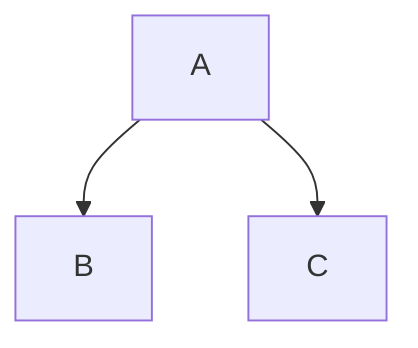
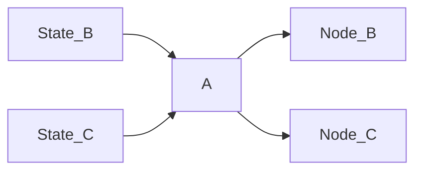

# Architecture

A concept discussed in Chris Hecker's [Structure Vs Style](https://youtu.be/4eQp8SdzOa0) and elaborated upon by [Kevin Dill](https://www.youtube.com/watch?v=IvK0ZlNoxjw&t=1082s) is that of a distinction betwee structure and style.

## ECS Priorities

Nodes tend to mutate lots of state, whereas Edges are more likely to read state. This means to avoid running node queries, and prefer edge queries where possible. This is why action state is added and removed.

## The Graph

One of the coolest parts of bevy is its systems with expressive querying. `gamai` is built entirely around that, each node is a system.
The structure of `gamai` is a directed tree graph, and uses graph theory terminology. It is paradigm agnostic, ie one node may have a utility filter, whereas another may use a binary filter.

A graph structure like this:

Will turn into four systems, where the states are checked before `node A` is run, so it can determine which child node to activate.

### Finite State Machines / GOTO

If you're used to finite state machines you may be looking for a way to `goto` some arbitary node from another. While this is *possible* if you know the `NODE_ID` of the target, it is [considered an antipattern](https://youtu.be/gXrKGTPwfO8?list=PLFQdM4LOGDr_vYJuo8YTRcmv3FrwczdKg&t=230). 

Also the tradeoff of the parallel nature of `gamai` is that it will only act on the jump on the next frame.
