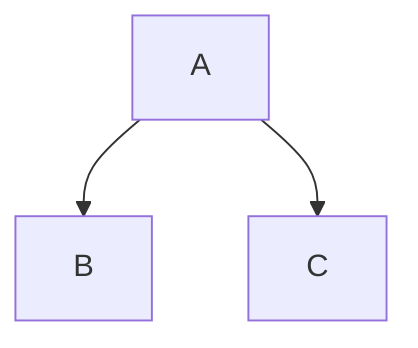
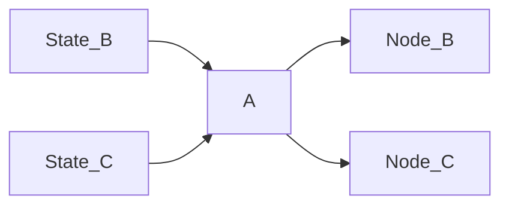

# Architecture


A concept discussed in Chris Hecker's [Structure Vs Style](https://youtu.be/4eQp8SdzOa0) and elaborated upon by [Kevin Dill](https://www.youtube.com/watch?v=IvK0ZlNoxjw&t=1082s) is that of a distinction betwee structure and style.

## ECS Priorities

Nodes tend to mutate lots of state, whereas Edges are more likely to read state. This means to avoid running node queries, and prefer edge queries where possible. This is why action state is added and removed.


## The Graph


One of the coolest parts of bevy is its systems with expressive querying. `gamai` is built entirely around that, each node is a system.
The structure of `gamai` is a directed tree graph, and uses graph theory terminology. It is paradigm agnostic, ie one node may have a utility filter, whereas another may use a binary filter.

A graph structure like this:

Will turn into four systems, where the states are checked before `node A` is run, so it can determine which child node to activate.


### Finite State Machines / GOTO

If you're used to finite state machines you may be looking for a way to `goto` some arbitary node from another. While this is *possible* if you know the `NODE_ID` of the target, it is [considered an antipattern](https://youtu.be/gXrKGTPwfO8?list=PLFQdM4LOGDr_vYJuo8YTRcmv3FrwczdKg&t=230). 


Also the tradeoff of the parallel nature of `gamai` is that it will only act on the jump on the next frame.


## Implementation

The primitive of `gamai` is the `node`,  Nodes are composed together using two fundamental concepts:
- [generic systems](#generic-systems)
- [compile-time trees](#compile-time-trees)

> Vocabulary from **graph theory** is used to reflect the unopinionated nature of `gamai`, here are some synonyms:
> - Node: `Action, Behaviour, Reasoner, Thinker`
> - Edge: `Consideration, Condition, Filter, Sensor, Scorer`

### Generic Systems

a `node_system` is a bevy system with a single `AiNode` generic argument which allows us to reuse the system in any context. Note the use of the generic parameter in queries:


### Example Action
An action can use the `NodeState` component to check whether it should run, and inform its parent of the current state.
```rs
// nodes run if their parent lets them
#[node_system]
fn child<Node: AiNode>(mut query: Query<&mut NodeState<Node>>){
	for mut state in query.iter_mut(){
		println!("this node is running, its state is {}", state);
		**state = NodeState::Success;
	}
}
```

### Example Reasoner
The parent node is also concerned about the state of its children. In this example it will select the first child that has a passing edge state.
```rs
#[node_system]
fn parent<Node: AiNode>(mut commands: Commands, mut query: Query<Node::ChildQuery>) {
	for (entity, edges) in Node::child_states(&mut query).iter() {
		for (index, edge) in edges.iter().enumerate() {
			if *edge == EdgeState::Pass {
				Node::set_child_node_state(&mut commands, *entity, index).unwrap();
				continue;
			}
		}
	}
}
```
Note the `Node::edges` function that converts a tuple query of `(Edge1,Edge2,Edge3)` into a `Vec<EdgeState>`.


### Compile-time Trees

Once we have our `node_system` primitives we can define our tree using rsx syntax:

```rs
type MyTree = gamai::tree!{
	<parent>
		<child/>
	</parent>
}
```
This does three things:
- Resolve generics in systems for their assigned node
- Specify system execution order
- Create component bundles for each tree


