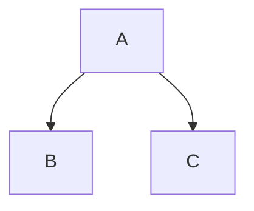
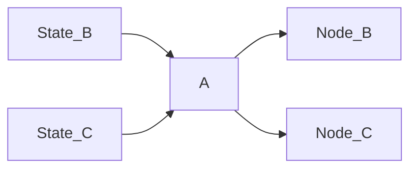

# Gamai

`gamai` is a flexible & extendable game AI library. It is based on ECS and weighted graph theory.

## Features

- 🔥 Parallel
- ✍️ No Blackboard
- 🌴 Digraph architecture
- 🌈 Paradigm agnostic
- 🌍 With or without Bevy
- 🐢 Systems all the way down

## Architecture

### The Graph

A concept discussed in Chris Hecker's [Structure Vs Style](https://youtu.be/4eQp8SdzOa0) and elaborated upon by [Kevin Dill](https://www.youtube.com/watch?v=IvK0ZlNoxjw&t=1082s) is that of a distintion betwee structure and style.

`gamai` is inspired by Dill's xml format for declaring ai behavior, the use of `rsx` gives us several advantages over runtime definitions:
- Oppourtunistic Parallelism - uses bevy's famous resolver
- Serialization - uses standard xml syntax

One of the coolest parts of bevy is its systems with expressive querying. `gamai` is built entirely around that, each node is a system.
The structure of `gamai` is a directed tree graph, and uses graph theory terminology. It is paradigm agnostic, ie one node may have a utility filter, whereas another may use a binary filter.

A graph structure like this:

Will turn into four systems, where the states are checked before `node A` is run, so it can determine which child node to activate.



### Best With Bevy

All nodes & edges are bevy systems. They run in parallel and can access anything a regular system can, which means no blackboard!

`gamai` can also be used with other engines, in which case the bevy world acts as the blackboard.

### Finite State Machines / GOTO

If you're used to finite state machines you may be looking for a way to `goto` some arbitary node from another. While this is *possible* if you know the `NODE_ID` of the target, it is [considered an antipattern](https://youtu.be/gXrKGTPwfO8?list=PLFQdM4LOGDr_vYJuo8YTRcmv3FrwczdKg&t=230). Also the tradeoff of the parallel nature of `gamai` is that it will only act on the jump on the next frame.

# Nodes

An `AiNode` is a single system, they can be thought of as Actions or Behaviours. Leaf nodes simply run behaviour, whereas branching nodes may additionally **select** a child node to activate.

## Edges

An `AiEdge` is a system used to dermine the validity of its associated node by setting the corresponding `EdgeState`, an enum of either:
- `Pass,Fail` (behaviour tree)
- `Weight(f32)` (utility)
- `RankedWeight(u32,f32)` (dual utility)

## Usage

```rs
todo!()
```
