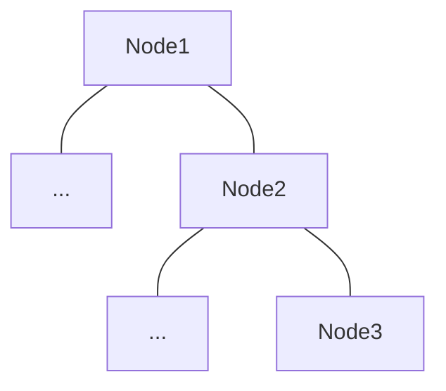
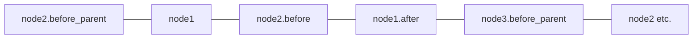

# Gamai

Gamai is a flexible task switching library suitable for game AI, robotics & other performance-critical environments. The primitives it provies can be used for multiple decision-making paradigms like Behaviour Trees, Utility AI and Goal Oriented Action Planning (GOAP). The ECS implementation uses opportunistic parallelism, ensuring trees are processed as quickly as possible.

**With Bevy**

If used with Bevy there is no blackboard, each node is a regular Bevy system with the same access to entities & resources.

**Without Bevy**

The lightweight [`bevy_ecs`][1] crate that drives Gamai has a great storage pattern, scheduling systems to safely run in parallel and storing data efficiently for the CPU cache.

## Features

- 🌴 Declarative Tree Definition
- 🔥 Compile-time Parallel Optimization
- ✍️ No Blackboard
- 🌈 Multi-paradigm
- 🌍 With or without Bevy


## Overview

Gamai has three fundamental concepts: `Props`, `Actions` & `Trees`.

## Props

A `Prop` is a regular bevy Component with an added `AiNode` generic argument, meaning the same prop can be used to represent the state of individual nodes in the tree.

## Actions

An `action` is a bevy systems with an added generic `AiNode` argument which can be used to access props and children:
```rs
#[action]
fn say_hello<N: AiNode>(mut query: Query<Entity, With<Prop<Running,N>>){	
	for mut state in query.iter_mut(){
		println!("hello");
	}
}
```

## Trees

Trees are defined using familiar RSX patterns like those found in web UI libraries. Each node can be either an action or a sub-tree.

```rs
#[tree_builder]
pub fn MyTree() -> impl AiNode {
	tree! {
		<sequence>
			<say_hello/>
			<SayWorld/> //a tree declared elsewhere
		</sequence>
	}
}
```

> `gamai` uses a naming convention like web UI libraries:
> - `actions` have snake_case
> - `trees` have PascalCase

### Further ordering.

So far each action will run consecutively according to their depth, but for frame-perfect execution sometimes we need to run something before the parent.

Other system orderings are accessible via attributes, examples are:
- `before_parent` Useful for GOAP / Utility selectors, allows preparing of score for each child node of a selector
- `before` - Tell children something before their `before_parent_system`
- `after` Good for frame-perfect nodes, with `apply_deferred` in between each layer

They are defined in `gamai` like so:
```rs
tree!{
	<my_action
		before_parent=set_score
		before=set_child_scoring_parameter
		after=cleanup
	/>
}
```

For example, the following tree would produce this system ordering:





### Running

Before we can run the above example we need two things:
- An `AiPlugin` schedules all systems in the tree:
  
	```rs 
	app.add_plugins(AiPlugin::new(MyTree));
	```
- A `PropBundle` will add given props to specified nodes in the tree.
	```rs
	// only set the root as running
	app.world.spawn(PropBundle::root(MyTree, Running));
	// set all nodes in the tree to have a failing score
	app.world.spawn(PropBundle::recursive(MyTree, Score::Fail));
	```

Putting it all together we get something like this:

```rs
fn main(){
	let mut app = App::new();	
	app.add_plugins(AiPlugin::new(MyTree));
	app.world.spawn(PropBundle::root(MyTree, Running));

	app.update(); // runs first child
	app.update(); // runs second child
}
```
```sh
> cargo run
hello
world
```
<!-- > This example uses `bevy`, see [no_bevy](./no_bevy) for more examples. -->

[1]: https://crates.io/crates/bevy_ecs
