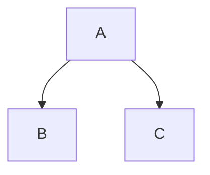
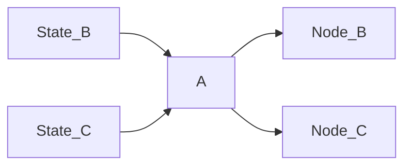

# Gamai

`gamai` is a flexible & extendable game AI library. It is based on ECS and weighted graph theory.

## Features

- 🔥 Parallel
- ✍️ No Blackboard
- 🌴 Tree graph architecture
- 🌈 Paradigm Agnostic
- 🌍 With or without Bevy

## Architecture

The structure of `gamai` is a directed tree graph, and uses graph theory terminology. It is paradigm agnostic, ie one node may have a utility filter, whereas another may use a binary filter.

A graph structure like this:

Will turn into four systems, where the states are checked before `node A` is run, so it can determine which child node to activate.



### Best With Bevy

All nodes & edges are bevy systems. They run in parallel and can access anything a regular system can, which means no blackboard!

`gamai` can also be used with other engines, in which case the bevy world acts as the blackboard.

### Jumping
It is *possible* to jump to other nodes, like in a Finite State Machine, but I personally consider it an antipattern that results in spaghettification. The tradeoff of the parallel nature of `gamai` is that it will only act on the jump on the next frame.

# Nodes

Nodes are a single system, they can be thought of as Actions or Behaviours. Leaf nodes simply run behaviour, whereas branching nodes may additionally select the next edge to activate.

## Edges

Edges are systems used to dermine the validity of their associated node which is done via setting the `EdgeState`. Common examples of this are:
- `Binary` (behaviour tree)
- `Weight` (utility)
- `RankedWeight` (dual utility)

## Usage

```rs
todo!()
```
