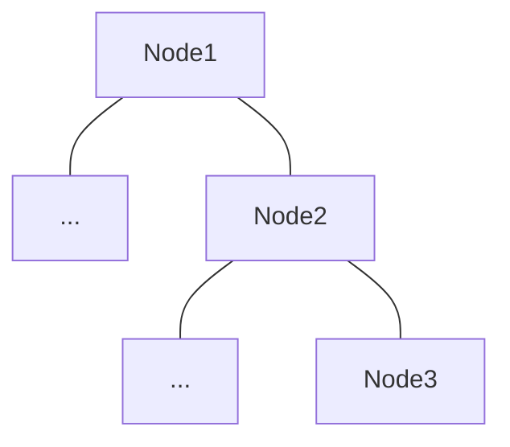
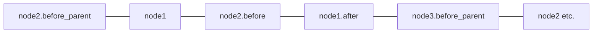

# Gamai

Gamai is a flexible task switching library suitable for game AI, robotics & other performance-critical environments. It features a modular tree structure and supports multiple selector paradigms like Utility AI and Goal Oriented Action Planning (GOAP). The ECS implementation allows for opportunistic parallelism, ensuring trees are processed as quickly as possible.

**With Bevy**

If used with Bevy there is no blackboard, as each node is a regular Bevy system with the same access to entities & resources.

**Without Bevy**

The lightweight [`bevy_ecs`][1] crate that drives Gamai makes for an excellent blackboard, scheduling nodes to safely run in parallel and storing data efficiently for the CPU cache.

## Features

- 🌴 Declarative RSX Trees
- 🔥 Automatic Parallelism & System Ordering
- ✍️ No Blackboard
- 🌈 Multi-paradigm
- 🌍 With or without Bevy

## Trees

Trees are defined using familiar RSX patterns like those found in web UI libraries. A unique aspect of `gamai` is that trees are parsed at *compile time* which gives us the nessesary type information for the parallel scheduler in `bevy_ecs`.

```rs
#[tree_builder]
pub fn MyTree() -> impl AiNode {
	tree! {
		<sequence>
			<say_hello/>
			<say_world/>
		</sequence>
	}
}
```

> `gamai` uses a naming convention like web UI libraries:
> - `node_systems` have snake_case 
> - `tree_builders` have PascalCase

### Nodes

Nodes are definitions of what systems should run for that node. The most common property is the `node_system` which is used 


### Further ordering.

Other positions in the tree are accessible via the 
Examples are:
- `node_system` Usually used to run an action or a selector
- `before_parent_system` Useful for GOAP / Utility selectors, allows preparing of score for each child node of a selector
- `before_node_system` - 
- `after_node_system` Good for frame-perfect nodes, with `apply_deferred` in between each layer

They are defined in `gamai` like so:
```rs
<sequence 
	before=do_this 
	before_parent=do_that
	/>


```


For example, the below example tree



Would produce a system ordering like this


`Nodes` are comprised of `node_systems` and `node_systems` are regular bevy systems with an added generic `AiNode` argument giving them access to the components that they need to communicate with parents and children. By design Nodes cannot communicate with grandparents/grandchildren. It seems like an antipattern by breaking the node-level modularity of the tree, but this can be looked into if there is a need.

```rs
#[node_system]
fn say_hello<Node: AiNode>(mut query: Query<&mut NodeState<Node>>){
	
	for mut state in query.iter_mut(){
		println!("hello");
		assert_eq!(**state, NodeState::Running);
		//tell parent it can go to the next node now
		**state = NodeState::Success;
	}
}
```

### Running

An `AiNode` has two methods for running:
- `MyTree.plugin()` provides the plugin that will add the systems to the world in the correct order.
- `MyTree.bundle()` provides the components nessecary for the tree to run for a given entity.


```rs
fn main(){
	let mut app = App::new();
	app.add_plugins(MyTree.plugin());
	app.world.spawn(MyTree.bundle());
	app.update(); // runs first child
	app.update(); // runs second child
}
```
```sh
> cargo run
hello
world
```
<!-- > This example uses `bevy`, see [no_bevy](./no_bevy) for more examples. -->

[1]: https://crates.io/crates/bevy_ecs
