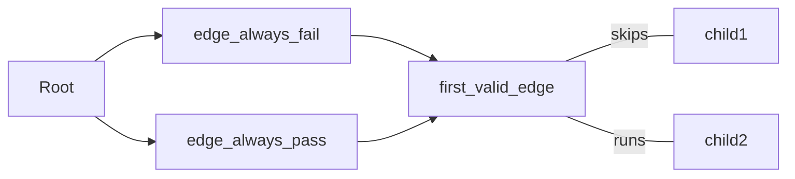

# Selectors

Nodes with children are usually tasked witk deciding which child should run. These have several names depending on the paradigm, here are a few synonyms:

`selector, planner, reasoner`

## Sequence

Perhaps the simples selector is the `sequence`. It runs each child in sequence.
```rs
#[tree_builder]
pub fn MyTree() -> impl AiTree {
	tree! {
		<sequence>
			<say_hello/>
			<say_world/>
		</sequence>
	}
}
```

## Edge Selectors (Considerations)

Nodes can accept an `edge` attribute, which is a Node System that runs *before* the parent, providing information on how valid it would be for its associated node to run. Here's an example of an edge system that always sets its state enum to `Pass`. Other options are `Fail` and `Weight(u32)`.


```rs
#[node_system]
fn edge_always_pass<Node: AiNode>(query: Query<&mut DerefEdgeState<Node>>){
	for state in query.iter_mut(){
			**state = EdgeState::Pass;
	}
}
```

This tree will skip `child1` and run `child2`:

```rs
#[tree_builder]
pub fn MyTree() -> impl AiTree {
	tree! {
		<first_valid_edge>
			<child1 edge=edge_always_fail/>
			<child2 edge=edge_always_pass/>
		</first_valid_edge>
	}
}
```

It would produce the following system ordering:


