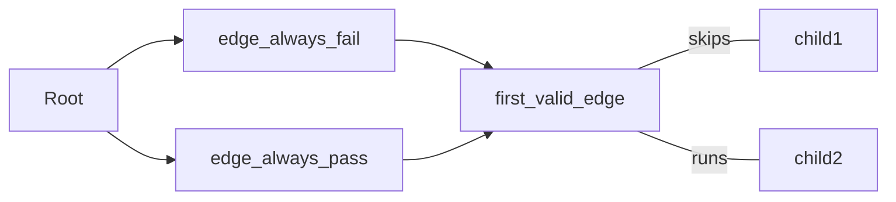

# Selectors

Selectors are Nodes with children, their job is to decide which child should run.

Nodes with children are usually tasked witk deciding which child should run. Depending on the paradigm used these may have These have several names depending on the paradigm, here are a few synonyms:

> In some paradigms selectors are also known as `planners` or `reasoners`

## Sequence

Perhaps the simples selector is the `sequence`. It runs each child in sequence until either completion or one fails.
```rs
#[tree_builder]
pub fn MyTree() -> impl AiNode {
	tree! {
		<sequence>
			<say_hello/>
			<say_world/>
		</sequence>
	}
}
```

## Utility AI

Nodes can accept a `before_parent` attribute, which is a Node System that runs *before* the parent. It can be used to provide a `Score` for each child. Here's an example of an edge system that always sets its score to `Pass`. Other options are `Fail` or `Weight(u32)`

```rs
#[node_system]
fn score_always_pass<Node: AiNode>(query: Query<&mut Prop<Score, Node>>){
	for state in query.iter_mut(){
			**state = Score::Pass;
	}
}
```

This tree will skip `child1` and run `child2`:

```rs
#[tree_builder]
pub fn MyTree() -> impl AiNode {
	tree! {
		<first_valid_edge>
			<child1 before_parent=score_always_fail/>
			<child2 before_parent=score_always_pass/>
		</first_valid_edge>
	}
}
```

It would produce the following system ordering:


