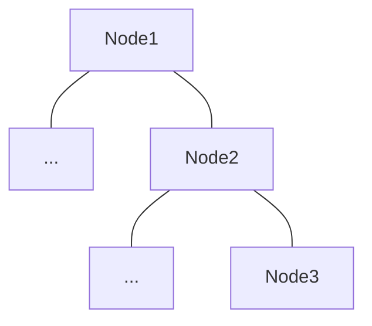
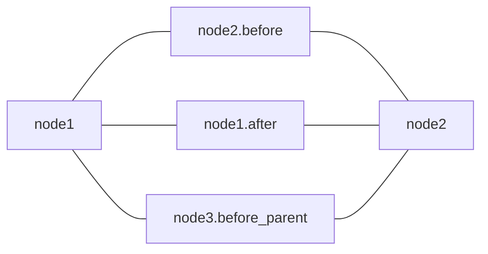

# System Ordering

Each action will run consecutively according to their depth, but for single-frame execution sometimes we need to run something before the parent.

Other system orderings are accessible via attributes, examples are:
- `before_parent` Useful for GOAP / Utility selectors, allows preparing of score for each child node of a selector
- `before` - Do something before a node runs, ie skip.
- `after` Good for single-frame execution, ie cleaning up run states.

They are defined in `gamai` like so:
```rs
tree!{
	<my_action
		before_parent = set_score
		before = cancel_if_elapsed
		after = cleanup
	/>
}
```

For example, the following tree would produce this system ordering:




The ordering can also be viewed using [`bevy_mod_debug_dump`](https://crates.io/crates/bevy_mod_debugdump)
