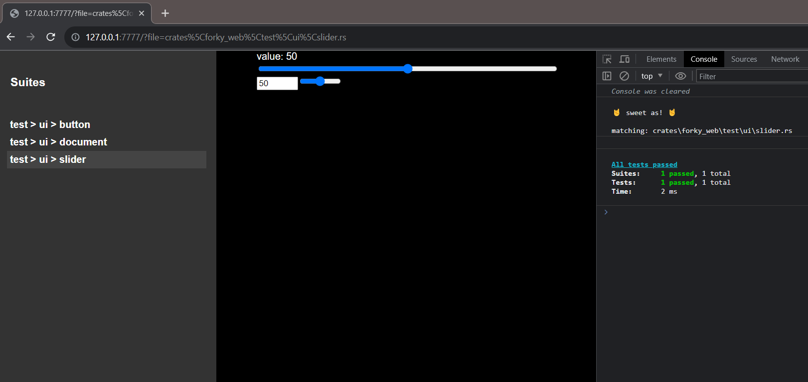

# Quickstart - Web

1. Follow native quickstart
1. install the helper cli: `cargo install forky_cli`
	- More details on the [cli page](../forky_cli/sweet.md)
2. mount some html and add some wasm matchers to your test
	```rs
	web_sys::window().unwrap()
			.document().unwrap()
			.body().unwrap()
			.set_inner_html("<h1>This is a heading</h1>");
	expect_el("h1")?.to_contain_text("This is a heading")?;
	```
3. run `forky sweet`
	- requires [wasm-bindgen-cli](https://rustwasm.github.io/wasm-bindgen/reference/cli.html)

Here's an example of a runner with a few tests:




> Note: to disable a few messy warnings its helpful to enable [this chrome feature](chrome://flags/#privacy-sandbox-ads-apis)
