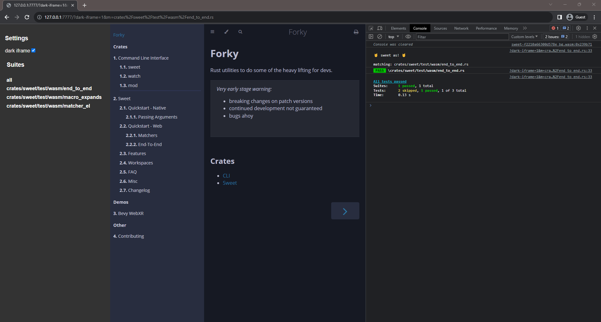

# End-To-End

By default web tests run inside the iframe. This is great for testing components, but when we want to test a page provided by the server we need a different approach.

Test cases marked as `e2e` will run in the parent process instead. The child `iframe` can be retrieved via `visit()`, at which point you can interact with the underlying document just like with unit tests.

Testing iframes from different origins can be [tricky](https://docs.cypress.io/guides/guides/web-security), by default a web browser will say "hey, this isnt your site, i won't let you see whats inside `iframe.contentDocument` etc". 

To make this easier, sweet provides a reverse proxy that will serve your url same origin. Its been tested on simple sites like these docs, but if you encounter any problems please create an issue.

### `visit()`

visit does three things:
1. Points the proxy to the provided url
2. Sets the iframe `src` to the proxy url
   - fyi this is will be something like `/_proxy_/http://localhost:3000`
3. awaits the iframe `load` event

### Example

Here's an example of an end-to-end test running on these docs:
```rs
sweet!{
	test e2e "docs origin" {
		let page = visit("http://localhost:3000").await?;
		expect(page)
			.poll(|p|p.to_contain_text("Forky")).await?;
	}
}
```

And the output looks like this:


